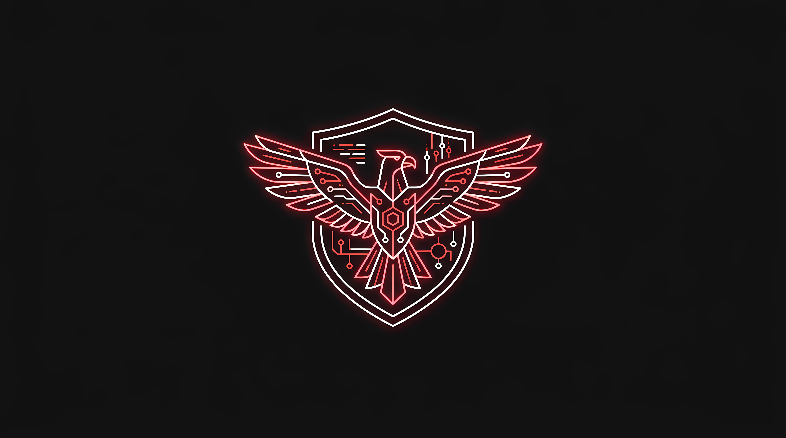

# Joseph_ICV-Dotfiles - Perú Cyber Security Theme 🇵🇪💻

Configuración de entorno gráfico ultra-personalizada basada en **i3WM** para Parrot OS (u otra distribución Debian/APT), tematizada en **negro puro y rojo neón** con estética de ciberseguridad minimalista.



## ✨ Características Principales
- **Entorno**: Gestión de ventanas con **i3 Window Manager (i3wm)** y barra superior modular **Polybar**.
- **Mosaicos Inteligentes (Estilo Hyprland)**: Las ventanas se dividen de forma automática alternando entre horizontal y vertical de acuerdo a sus dimensiones físicas.
- **Ventanas Flotantes Avanzadas (Estilo Windows)**: Al flotar una ventana (`Super + Shift + f`), esta adquiere marcos y barra de título estándar, permitiéndote moverla haciendo clic y arrastrando con el mouse, y redimensionarla desde las esquinas.
- **Tematización Perú Cyber**: Toda la paleta del sistema unificada en negro absoluto y rojo neón (aplicado en Polybar, Kitty, Rofi e i3wm).
- **Lanzador por Secciones & Búsqueda Rápida**: Buscador interactivo Rofi agrupado por carpetas para tus herramientas de ciberseguridad, con barra de búsqueda global inteligente integrada (escribe y presiona Enter).
- **Logotipo ASCII Personalizado**: Dibujo detallado a color (rojo y blanco) de la insignia nacional de ciberseguridad en tu terminal al abrir Kitty (Fastfetch).
- **Atajos Multimedia**: Control de volumen con Pipewire (`wpctl`), brillo de pantalla (`brightnessctl`) y capturas interactivas de pantalla con el botón `Print Screen` (Maim sin desenfoque).
- **Selector de Wallpapers**: Cambia entre tus fondos preferidos al instante pulsando `Super + Shift + w`.

---

## 🚀 Instalación en un Solo Comando

Para instalar automáticamente todas las dependencias del sistema, clonar las configuraciones y aplicarlas, ejecuta la siguiente línea en tu terminal:

```bash
git clone https://github.com/dzenwertz/Joseph_ICV-Dotfiles.git ~/.dotfiles && cd ~/.dotfiles && ./install.sh
```

El script `install.sh` se encargará de:
1. Instalar las dependencias (`i3`, `polybar`, `rofi`, `picom`, `maim`, `kitty`, `fastfetch`, etc.) usando `apt-get`.
2. Crear los enlaces simbólicos de las carpetas a tu directorio `~/.config/`.
3. Dar permisos de ejecución a los scripts y demonios de fondo.
4. Integrar **Upscayl** en tu buscador de aplicaciones Rofi (si tienes el AppImage en tu carpeta de Descargas).

---

## ⌨️ Atajos Clave de Teclado
| Atajo | Acción |
|---|---|
| `Super + Shift + Enter` | Abrir terminal **Kitty** (arranque veloz 0.15s) |
| `Super + d` | Lanzador de aplicaciones **Rofi** por categorías |
| `Super + e` | Abrir gestor de archivos **Caja** (estilo Explorador) |
| `Super + Shift + f` | Alternar ventana entre modo mosaico y **flotante** |
| `Super + Shift + w` | Abrir selector interactivo de fondos de pantalla |
| `Impr Pant` (Print) | Captura interactiva de pantalla (copia al portapapeles) |
| `Fn + Arriba / Abajo` | Subir / Bajar Volumen |
| `Fn + Izquierda / Derecha` | Subir / Bajar Brillo de Pantalla |
| `Super + Shift + r` | Reiniciar i3 en caliente (aplica cambios al instante) |
| `Super + Shift + e` | Menú de apagado y cierre de sesión |
